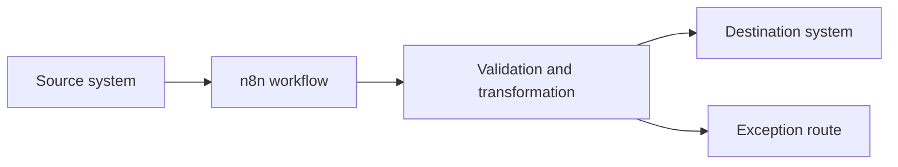

# Case study title

One sentence describing what the workflow does and why it matters.

## Snapshot

| | |
|---|---|
| Type | Production workflow, operational workflow, working prototype or technical demo |
| My role | Designed and built from scratch |
| Main tools | n8n, APIs, databases, applications and scripting languages |
| Primary pattern | Event driven, scheduled batch, human in the loop or agentic workflow |
| Data shown | Synthetic or anonymised |

## The problem

Describe the starting process in plain business terms. Explain who was doing the work, what was manual or unreliable and why the problem mattered.

## Constraints

List only the constraints that affected the design, such as API limits, incomplete source data, partial fulfilments, asynchronous callbacks or a required manual approval.

## The approach

Explain the shape of the solution before discussing individual nodes. A reader should understand the system without opening n8n.

## Architecture

## Important implementation decisions

Use a short numbered list. Focus on decisions that show judgement, not every node in the workflow.

## Reliability and edge cases

Cover retries, duplicate prevention, validation, failure routes, logging, rate limits, partial success and manual recovery.

## Result

State the outcome. Use measured figures only when they can be defended and disclosed publicly.

## What I built

State your personal contribution clearly. Mention any AI coding assistance without implying that the design or implementation was generated automatically.

## Evidence

- `assets/workflow-overview.png`
- `assets/key-logic.png`
- `assets/result-example.png`
- Optional short demo link
- Optional sanitised n8n export in `workflow/`

## Confidentiality

Explain what has been anonymised, simplified or removed.
