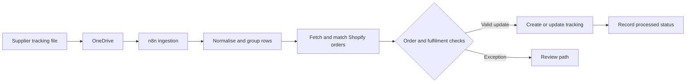
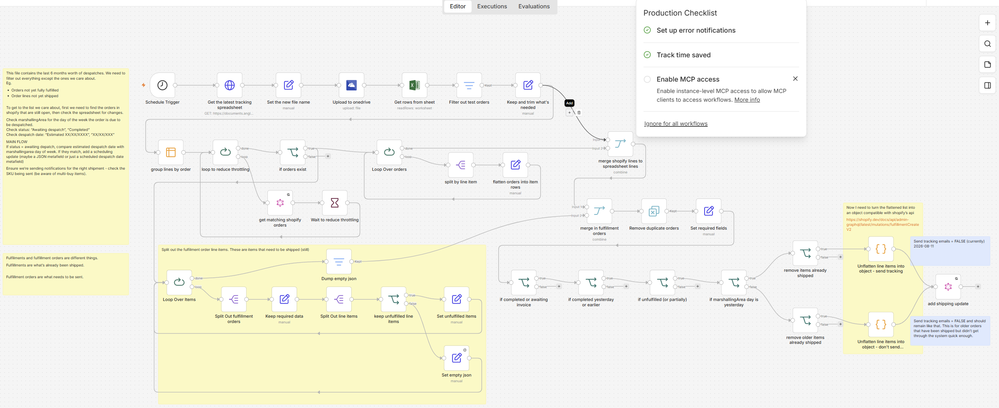
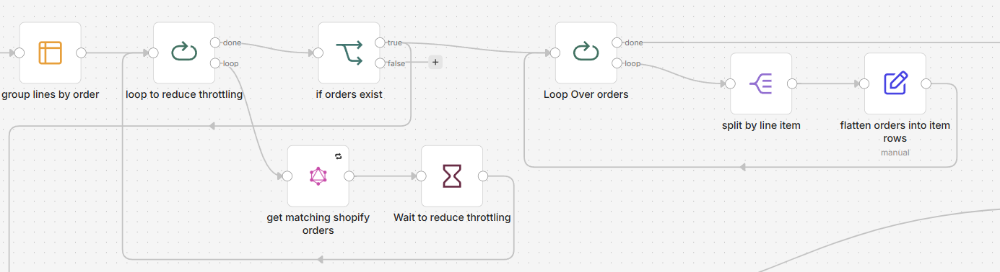

# Order tracking and fulfilment reconciliation

A production n8n workflow that turns supplier tracking files into matched, validated Shopify fulfilment updates while accounting for partial shipments and operational exceptions.

## Snapshot

| | |
|---|---|
| Type | Production workflow, presented with client and supplier details removed |
| My role | Designed and built from scratch |
| Main tools | n8n, Shopify, OneDrive, spreadsheets, JavaScript and APIs |
| Primary pattern | Scheduled batch processing with validation and exception routes |

## The problem

Tracking information arrived in supplier spreadsheets rather than directly through a consistent order API. The data had to be matched against ecommerce orders and line items before a customer-facing shipment update could be created. Rules required for mapping inconsistent column data into usable information.

A simple order-number lookup was not enough. Orders could contain several items, ship in parts, remain unfulfilled or reach a status where an update should not be applied. Duplicate rows and delayed files also created a risk of repeating an update.

## The approach

The workflow retrieves the latest tracking file, converts the rows into a consistent structure and groups them by order. It then fetches the matching Shopify orders, compares supplier lines with Shopify line items and evaluates the current order and fulfilment state.

Valid updates continue to the shipment-update path. Items that do not match the expected conditions are separated so they can be reviewed rather than silently changing an order.

## Architecture

A standalone Mermaid source is available in [architecture.mmd](architecture.mmd).

## Important implementation decisions

1. The workflow matches at order and line-item level rather than trusting a single reference field.
2. Data is flattened and regrouped at different stages so spreadsheet rows can be compared with Shopify's nested order structure.
3. Current order and fulfilment states are checked before updates are applied.
4. Duplicate-removal steps are used around joins and update paths.
5. JavaScript handles transformations that would be difficult to express clearly through standard mapping nodes alone.
6. The workflow separates exceptions from valid updates instead of allowing partial or ambiguous matches to continue.

## Reliability and edge cases

- Partial fulfilments and multi-line orders
- Duplicate spreadsheet rows
- Orders that are already completed or in an incompatible state
- Supplier lines that do not match a Shopify variant
- Delayed files and repeated processing
- Empty or malformed tracking values
- Large inputs processed through loops rather than one unbounded request
- Recoverable exceptions kept visible for operational review

## Result

The workflow reduced manual reconciliation between supplier tracking files and Shopify. It also made shipment updates more consistent by applying the same matching and status rules to every file. The workflow also provided the trigger for sending shipment notifications to customers directly from Shopify.

## What I built

I designed the workflow structure, matching logic, Shopify integration, status rules, data transformations and exception handling. I used AI coding tools to help with parts of the JavaScript in Code nodes, then reviewed, tested and adapted the code in the context of the full workflow.

## Evidence

Workflow Overview

Matching and status logic

