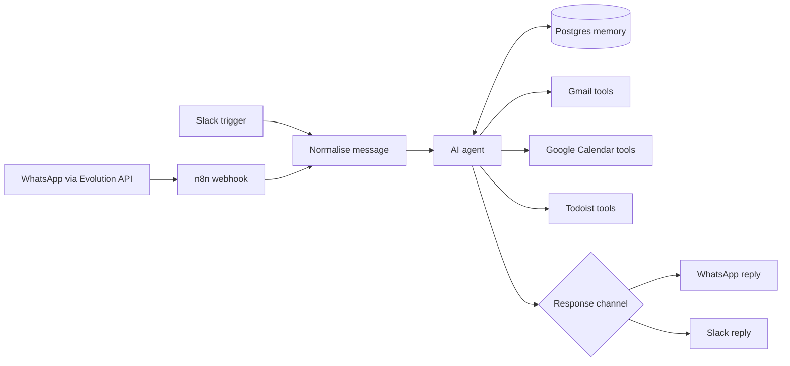
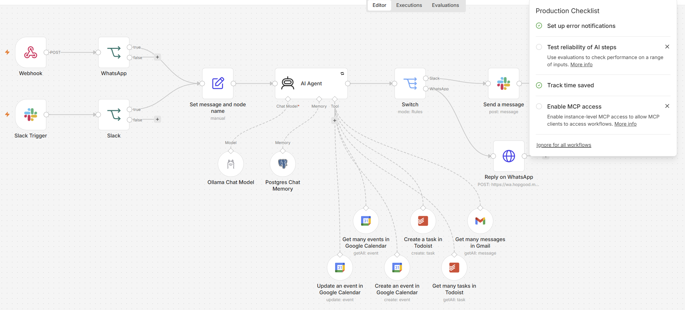

# WhatsApp AI assistant with tools and memory

A working prototype that receives WhatsApp and Slack messages through the Evolution API and lets an AI agent use a controlled set of email, calendar and task tools while retaining conversation context in Postgres.

## Snapshot

| | |
|---|---|
| Type | Working prototype and personal automation |
| My role | Designed and built from scratch |
| Main tools | n8n, Evolution API, Ollama, Postgres, Gmail, Google Calendar, Todoist and Slack |
| Primary pattern | Event-driven agent with tool calling and persistent memory |

## The problem

Useful AI assistants need more than a chat response. They need access to specific tools, a safe way to receive and return messages and enough memory to preserve context between separate requests.

The aim was to create one conversational entry point that could answer through WhatsApp or Slack and perform practical actions such as searching email, checking or updating a calendar and creating tasks.

## The approach

Messages enter n8n through a webhook or channel trigger and are normalised into a common request shape. An AI agent receives the message, uses a local Ollama model and stores short-term conversation context in Postgres.

Only the tools attached to the agent can be called. The final response is routed back to the originating channel.

## Architecture

A standalone Mermaid source is available in [architecture.mmd](architecture.mmd).

## Important implementation decisions

1. WhatsApp is integrated through authenticated HTTP requests to the Evolution API rather than relying on a single platform-specific node.
2. Channel inputs are normalised before they reach the agent.
3. Postgres memory is kept separate from the language model so conversation state can persist across workflow executions.
4. The agent receives a limited tool set rather than unrestricted access to external systems.
5. Calendar operations are split into read, create and update tools.
6. The response route uses the originating channel so the agent logic is not duplicated for WhatsApp and Slack.

## Reliability and edge cases

- Retry handling on the agent step
- A controlled list of actions the agent can perform
- Channel-specific response formatting
- Persistent memory with a bounded context window
- Tool parameters supplied through structured AI fields
- Separation between the conversation layer and the external APIs
- Clear failure points for webhook, model and downstream tool errors

## Result

The workflow shows an agent that can do useful work rather than only generate text. It combines conversational input, persistent memory, tool use and multi-channel responses in one n8n design.

## What I built

I designed and built the workflow, Evolution API integration, channel routing, memory layer and tool connections. AI coding assistance was used where useful for small code or expression tasks, with manual review and testing.

## Evidence 

Workflow Overview

## Confidentiality

The public version does not expose phone numbers, WhatsApp instance names, API hosts, calendar IDs, email accounts, task-list IDs, internal IP addresses.
