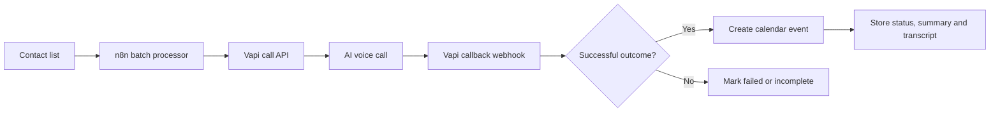
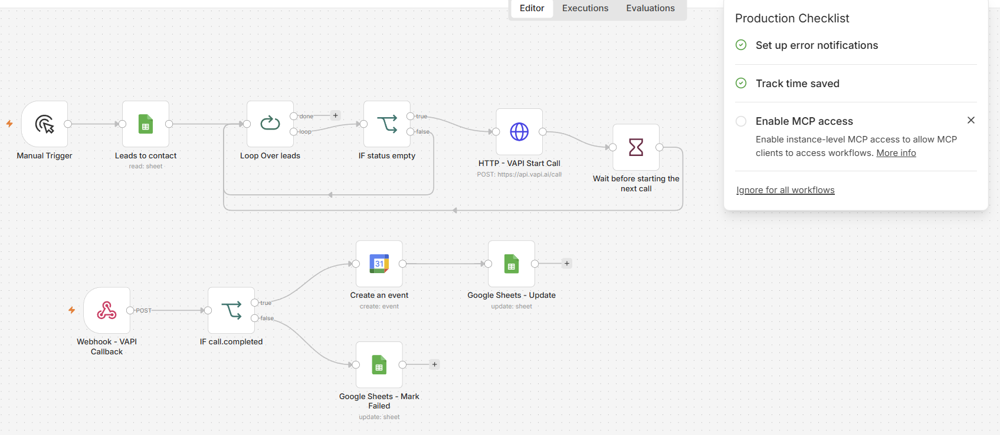
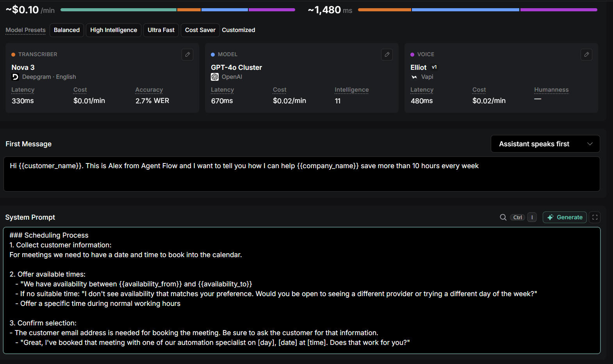
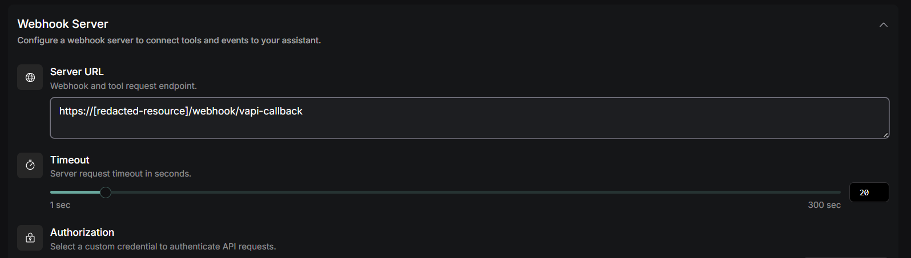
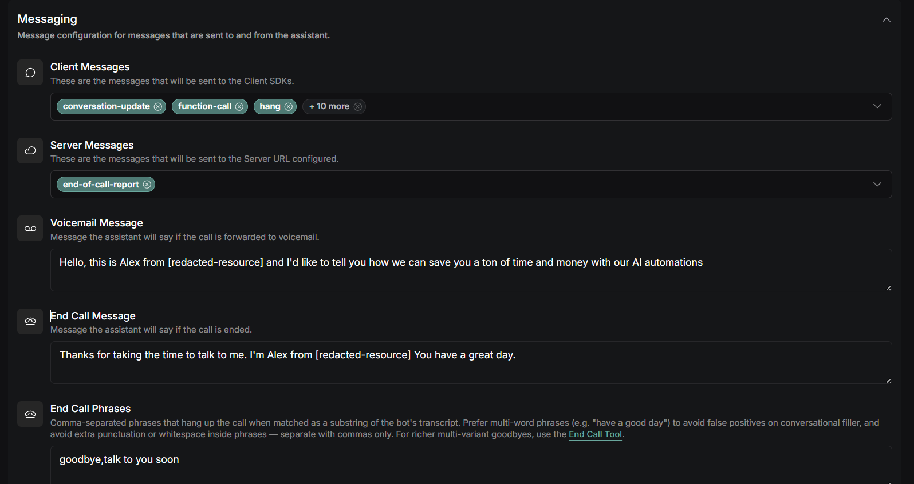

# Voice agent appointment booking

A simple voice agent that starts outbound AI voice calls, processes asynchronous call results and creates a calendar appointment when the conversation meets the success criteria.

## Snapshot

| | |
|---|---|
| Type | Voice Agent |
| My role | Designed and built from scratch |
| Main tools | n8n, Vapi, Google Sheets, Google Calendar, webhooks and REST APIs |
| Primary pattern | Outbound request plus asynchronous callback |

## The problem

Voice-agent platforms handle the conversation, but a useful business workflow must also prepare the call, pass the right context, wait for the result and turn the outcome into structured operational data.

The workflow uses a common sales or service pattern: call a contact, collect appointment details, book the meeting and record the transcript and summary. Failed or incomplete calls should be visible rather than treated as successful.

## The approach

The workflow reads contacts from a spreadsheet and processes them in a loop. It sends a call request to the Vapi API with contact-specific variables and then waits for a webhook callback.

The callback is evaluated against a success condition. A successful result creates a calendar event and writes the booking status, transcript, summary and meeting details back to the source data. A failed result follows a separate update path.

## Architecture

A standalone Mermaid source is available in [architecture.mmd](architecture.mmd).

## Important implementation decisions

1. Starting a call and receiving the result are treated as separate asynchronous events.
2. Contact-specific variables are passed into the voice assistant rather than embedding each contact in the assistant configuration.
3. The callback is checked for a structured success result before any appointment is created.
4. Meeting details, summary and transcript are stored as structured fields for later use.
5. The contact loop can continue while previous calls wait for callbacks.
6. Failed calls are recorded explicitly.

## Reliability and edge cases

- API timeout when starting a call
- Callback arriving after the initiating execution has moved on
- Call completed without the required appointment information
- Invalid or missing phone number
- Duplicate callback or repeat processing
- Calendar creation failure after a successful call
- Clear distinction between attempted, failed and booked states

## Result

The workflow proves the integration pattern needed to connect a voice platform with operational systems. It covers the full path from source record to call, callback, appointment and structured post-call data.

## Related Twilio work

I have also built a smaller Twilio and n8n workflow that captures voicemail and surfaces it in Outlook for follow-up. 

## What I built

I designed and built the Vapi API calls, callback webhook, success branching, Google Sheets state updates and calendar-booking path. 

## Evidence

Workflow Overview

VAPI Settings Prompt Snippet

VAPI Settings 1

VAPI Settings 2

