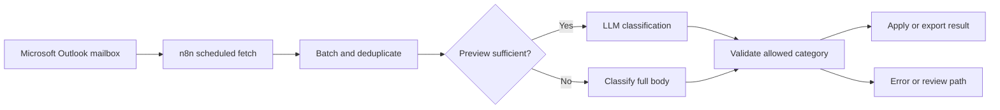
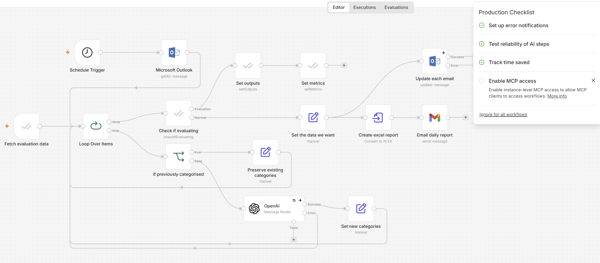
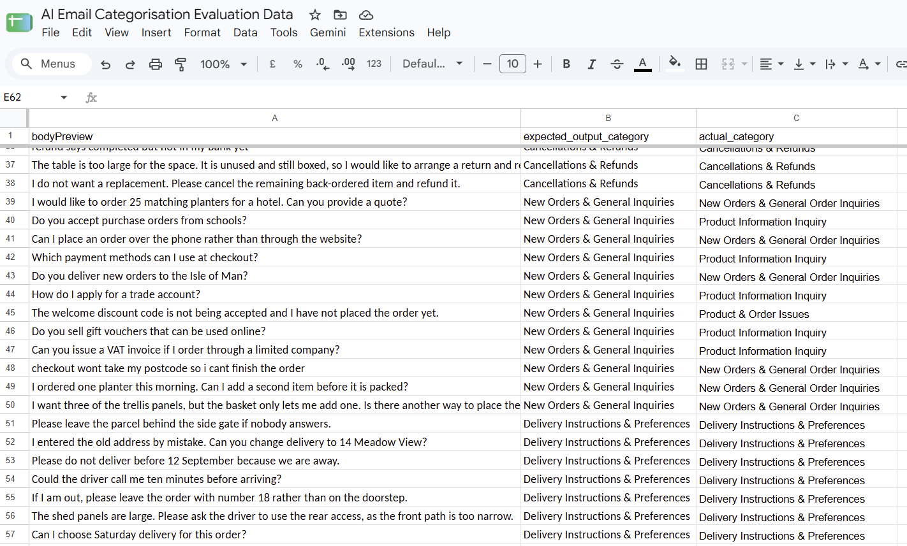

# AI email classification and triage

An operational n8n workflow that retrieves customer-service email, classifies each message against a controlled category list and produces structured output for routing and review.

## Snapshot

| | |
|---|---|
| Type | Operational workflow, presented with client details removed |
| My role | Designed and built from scratch |
| Main tools | n8n, Microsoft Outlook, OpenAI, Nextcloud and spreadsheets |
| Primary pattern | Scheduled batch classification with retries and validation |

## The problem

A shared customer-service mailbox contained a mixture of product questions, delivery queries, cancellations, refunds and order issues. Reviewing and categorising each message manually consumed a large part of the working day and made prioritisation inconsistent.

The workflow needed a controlled output rather than an unconstrained AI summary. It also needed to cope with messages where the short preview did not contain enough information for a reliable category.

## The approach

The workflow retrieves email fields from Outlook and processes messages in a loop. An OpenAI step classifies each message against a defined list of customer-service categories and returns structured JSON.

Where the preview is insufficient, the workflow can use the full email body. Results are merged with existing tracking data, duplicates are removed and the output is written back to the operational process or exported for review. Evaluation test data used to measure the quality of the output against human-categorised emails provided metrics for improving the categorisation prompt on a lower cost LLM.

## Architecture

A standalone Mermaid source is available in [architecture.mmd](architecture.mmd).

## Important implementation decisions

1. The model must select from a fixed category taxonomy.
2. Structured JSON output is used so downstream steps do not have to interpret prose.
3. The workflow can fall back from the message preview to the full body.
4. Messages are processed in batches to control throughput and model usage.
5. Retries and error outputs are configured around the model call.
6. Existing tracking data is used to avoid repeating work.

## Reliability and edge cases

- Empty or misleading email previews
- HTML-heavy message bodies
- Model response outside the allowed categories
- Temporary API failure or rate limiting
- Duplicate messages or previous classifications
- Messages that still need human review
- Attachment content excluded unless a separate extraction path is used

## Result

The wider email classification and triage automation reduced manual review effort by approximately four hours per day and made category assignment more consistent. Human review remained available for unclear messages rather than forcing every email through an automatic decision.

## What I built

I designed the Outlook retrieval, batching, classification taxonomy, model prompts, structured outputs, retry behaviour, duplicate checks and reporting path. 

## Evidence 

Workflow Overview

Evaluation Data

