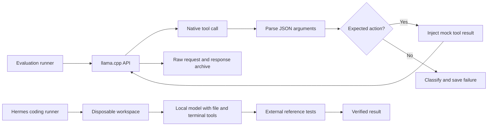
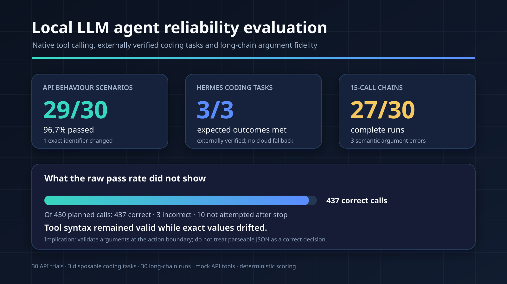

# Evaluating a local LLM for reliable agent tool use

A controlled evaluation of whether a locally hosted language model could reliably select tools, preserve exact arguments and complete small coding tasks through an agent framework.

## Snapshot

| | |
|---|---|
| Type | Controlled local-model reliability evaluation |
| My role | Designed the methodology, built the evaluation harnesses and verified the results |
| Main tools | Hermes Agent, llama.cpp, Python, OpenAI-compatible tool calling and a quantised GGUF model |
| Primary pattern | Repeatable agent evaluation with mock tools, saved evidence and external verification |

## The problem

A successful demonstration does not establish that a language model is reliable enough to operate as a coding agent. An agent must repeatedly choose the right tool, preserve identifiers and data types, use returned information in later actions, recognise failures and stop at the right time.

Longer runs create a less obvious risk: a model can keep producing syntactically valid tool calls while gradually changing an identifier or anticipating a later step. Those calls look healthy to an API client but can perform the wrong action.

The aim was to replace informal testing with a bounded and repeatable baseline that could answer three questions:

1. Can the model use native tool calls correctly across different behaviours?
2. Can it complete small coding tasks through Hermes without cloud fallback?
3. Can it preserve exact state through a demanding 15-call conversation?

## The approach

I separated the work into three evaluation layers.

### 1. API behaviour scenarios

The first harness ran six scenarios five times each, for 30 scored trials:

- select the correct tool from several plausible alternatives;
- preserve exact identifiers and argument types;
- make a second call using data from the first result;
- respond honestly to a mock tool error;
- answer from returned data and then stop;
- answer a question that genuinely needs no tool.

Scored requests used automatic tool selection. Generated calls were never executed: the harness parsed the call, compared the JSON arguments with the expected object and injected deterministic mock results where another turn was required.

### 2. End-to-end coding tasks

The second harness launched Hermes explicitly against the local model and supplied only file and terminal tools. It tested:

- inspecting several files and reporting exact findings;
- fixing a seeded calculation bug and running tests;
- handling a deliberately incorrect test without changing correct production code or claiming success.

Each task ran in a disposable workspace with a secret-free temporary Hermes configuration and no cloud fallback. Reference tests lived outside the model-editable directory and were run again by the evaluator after the agent stopped.

### 3. Long tool-call chains

The final harness ran 30 conversations requiring 15 sequential calls each: 450 planned calls in total. Every step returned the exact next step number and a deterministic token. The next call had to reproduce both values exactly.

The run stopped at its first mismatch. This made it possible to distinguish valid tool-call formatting from correct tool-call behaviour.

## Architecture

A standalone Mermaid source is available in [architecture.mmd](architecture.mmd).

## Important implementation decisions

1. **Freeze the runtime baseline.** Model file, llama.cpp build, context size, sampling settings and request limits were recorded before scoring.
2. **Use automatic tool selection.** Forced calls are useful diagnostics, but they were kept outside the scored trials.
3. **Compare parsed JSON.** Argument objects were parsed and compared by value instead of comparing serialised JSON strings.
4. **Keep exact-value checks.** Identifiers, booleans, integers, step numbers and returned tokens were validated without normalisation.
5. **Retain evidence.** Every API request and response was saved locally with its scenario, attempt and seed.
6. **Classify failures.** Tool-format errors, wrong actions, wrong arguments, transport failures and incorrect answers were kept separate.
7. **Do not execute generated actions.** API tests used mock tools only.
8. **Verify outside the agent.** Coding-task claims were checked using reference tests that the model could not edit.
9. **Remove cloud fallback.** End-to-end tasks measured the local model rather than silently recovering through a stronger provider.
10. **Stop chained trials at first failure.** Later successes could not conceal the first incorrect action.

## Results

| Evaluation | Result | Main finding |
|---|---:|---|
| API behaviour scenarios | 29/30 passed | One exact ticket identifier was changed in an otherwise valid tool call |
| Hermes coding tasks | 3/3 met the expected outcome | Inspection, bug fixing and failed-test handling were externally verified |
| Fifteen-call chains | 27/30 completed | Two runs skipped ahead; one invented an incorrect token |
| Strict chained calls | 437 correct; 3 incorrect; 10 not attempted after stop | Semantic argument drift was the main long-run weakness |

The 30 API trials produced no malformed tool calls, wrong tool selections or transport failures. The one failure changed `DEMO-42` to `DEM-42`.

The long-chain evaluation also produced no malformed tool calls. All three failed steps had a parsed `advance_chain` call and a `tool_calls` finish reason, but the arguments were wrong. Two calls skipped ahead by one step; one retained the requested step number but invented a token that had never been returned.

## What the evaluation demonstrated

The model could use native llama.cpp tool calls and complete small, controlled coding tasks through Hermes. Its main observed weakness was not API syntax. It was semantic reliability: preserving exact values over repeated steps.

That distinction matters operationally. A syntactically valid call can pass through normal API handling while targeting the wrong ticket, account, file or workflow step. Production agents therefore need validation at the action boundary, bounded retries, durable handoffs and external verification for consequential changes.

The baseline supported controlled experimentation with the model, but not promoting it directly to an unrestricted autonomous developer role.

## Evidence and rerun materials

This public case study includes:

- [the compact evaluation summaries and runtime manifest](evaluation/README.md);
- [a generic six-scenario tool-call evaluator](scripts/tool_call_evaluator.py);
- [a generic long-chain evaluator](scripts/chain_evaluator.py);
- [the disposable Hermes coding-task runner and fixtures](scripts/hermes_coding_evaluator.py);
- curated, sanitised failure examples;
- the architecture source and results visual.

The complete raw run archive is intentionally not published. It contains hundreds of repetitive request and response files and environment-specific paths that are unnecessary for reviewing the method. The original evidence was retained locally when the baseline was run.

## What I built

I designed the evaluation scenarios, scoring rules, failure taxonomy, deterministic chain protocol and disposable Hermes task runner. I ran the baselines, investigated the failures, preserved the raw evidence and converted the findings into an acceptance decision rather than relying on a successful demonstration.

AI assistance was used to accelerate implementation and review of the harnesses. I defined the evaluation goals and constraints, checked the generated code, ran the tests, inspected the failed cases and made the final reliability assessment.

## Confidentiality

The public scripts and summaries use local placeholder endpoints and synthetic identifiers. LAN addresses, credentials, profile configuration, absolute home paths, session data and full raw transcripts are excluded.
